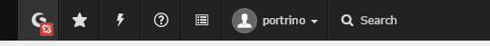
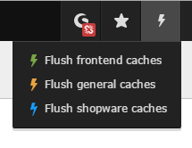

.. ==================================================
.. FOR YOUR INFORMATION
.. --------------------------------------------------
.. -*- coding: utf-8 -*- with BOM.

.. include:: ../../Includes.txt

.. _extension-manager-configuration:

Extension Manager configuration
^^^^^^^^^^^^^^^^^^^^^^^^^^^^^^^

After the installation (:ref:`for-administrators`) is completed you can configure the extension by clicking on the gear
icon.

Enable API access
-----------------

First of all you have create a backend user and enable the API access
(For more information about the shopware REST-API we recommend this article: https://developers.shopware.com/developers-guide/rest-api/

.. figure:: ../../Images/ForAdministrators/shopware-api-add-user.png
   :alt: Add API user in shopware
   :width: 600px
.. :align: center
.. :name: Add API user in shopware

   Add API user in shopware and enable API access

Finally you can copy the API credentials and put them into the extension configuration of px_shopware
The credentials are necessary to communicate with the shopware instance.

.. figure:: ../../Images/ForAdministrators/px_shopware-configure-basic-api.png
   :alt: API-Konfiguration in der px_shopware
   :width: 600px
.. :align: center
.. :name: API-Konfiguration in der px_shopware

After changing the API configuration you should refresh your backend by pressing ``Strg + F5`` to see the connection
state in the toolbar on top.

Shopware-Connector: Toolbar
---------------------------

Within the TYPO3 toolbar the connection state and some other information will be displayed.

.. :align: left

   TYPO3 toolbar shows state "disconnected"

By clicking the toolbar icon the overlay with some information about the connected shop will be opened.

.. figure:: ../../Images/ForAdministrators/toolbar-trial-version.png
   :alt: TYPO3 toolbar shows state "connected"
   :width: 500px
.. :align: left

   After you enter the correct shopware API credentials the connection state should display "connected"

**Informations:**

* Connection state: disconnected (red), connected trial version (yellow), connected full version (green)
* Shops: name of the shop instances in the connected shopware system
* Version and revision of the connected shopware system
* cache state and the number of entries in the cache tables

.. important::

   The TYPO3 toolbar information will be based on the API configuration from extension manager or typoscript
   configuration (:ref:`typoscript-configuration`) of your rootpage. TypoScript configuration has higher priority in
   this case.

Caching
-------

API request will be cached via internal caching framework of TYPO3 which increases the performance for loading articles,
categories etc.

The caching configuration could be done in extension manager configuration.

.. figure:: ../../Images/ForAdministrators/px_shopware-configure-cache.png
   :alt: Configure Caching in extension manager
   :width: 600px
.. :align: center

**Settings:**

* Cache Lifetime: The cache lifetime in seconds (e.g.: 3600 means 1 hour)
* Disable Caching: Disable caching may lead to performance decreases, because every API request is done directly

You can flush the shopware cache by clicking the blue bolt in the cache menu

.. :align: left

.. note::

   Since TYPO3Connector Plugin version **2.0.0** you can add the API-URL (http://domain.tld/?type=1471426941) from your TYPO3 PxShopware endpoint to the counterpart backend user on
   shopware side, SW will notifiy TYPO3 about changes in articles, categories etc. an the affected cache entries will be flushed
   then - This is a much better way than flushing all caches manually or at midnight ;-)

.. figure:: ../../Images/ForAdministrators/shopware_api_url.png
   :alt: Add API-URL to shopware backend user
   :width: 800px
.. :align: left

   Add API-URL to shopware backend user

More information to the caching framework of TYPO3 you could find here:

* https://docs.typo3.org/typo3cms/CoreApiReference/CachingFramework/Index.html
* http://typo3blog.at/blog/artikel/typo3-caching-grundlagen/

Logging
-------

The extension uses the TYPO3 Systemlog_ und the Logging-API_. Logfile from Logging-API will be located under
``typo3temp/logs/``.

The logging of backend errors yould be disabled in extension manager.

.. figure:: ../../Images/ForAdministrators/px_shopware-configure-logging.png
   :alt: Configure logging
   :width: 600px
.. :align: center

.. _Systemlog: https://docs.typo3.org/typo3cms/CoreApiReference/ApiOverview/SystemLog/Index.html
.. _Logging-API: https://docs.typo3.org/typo3cms/CoreApiReference/ApiOverview/Logging/Index.html
