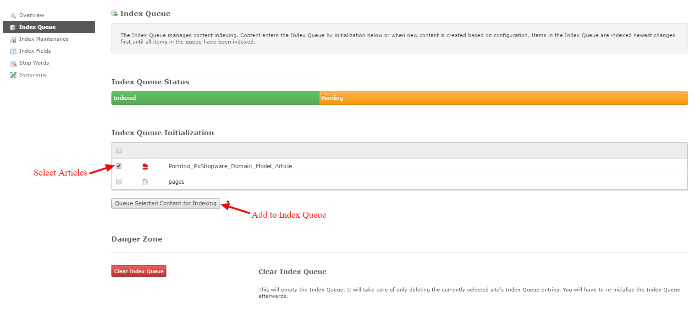
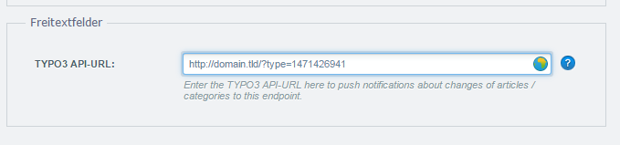

.. ==================================================
.. FOR YOUR INFORMATION
.. --------------------------------------------------
.. -*- coding: utf-8 -*- with BOM.

.. include:: ../../Includes.txt

.. _solr-configuration:

Solr configuration
^^^^^^^^^^^^^^^^^^^^^^^^^^^^^^^

First install and configure the solr plugin like described in manual_.
If you included the static typoscript (:ref:`typoscript-configuration`) a default TS config for solr indexing of articles is included.

Start indexing
-----------------

You can now queue articles for indexing. Open Backend "Search" module and select "Index Queue" from TOC.
Select "Portrino_PxShopware_Domain_Model_Article" and/or "pages" and click "Queue Selected Content for Indexing".

.. :align: left

   Add Articles to solr index queue

After that you need to create an indexing task. Open Backend module "Scheduler" and search for a task named "Index Queue Worker (solr)".
If it is there and active you are finished. If not create it like described here_.
Start the task and you should see the first results in frontend.

Configure Query
---------------------------

You need to configure the fields your search uses and the importance of those fields in TS. Here is an example

::

    plugin.tx_solr {
        search {
            ## qf parameter http://wiki.apache.org/solr/DisMaxQParserPlugin#qf_.28Query_Fields.29
            queryFields = productNumber_textS^49.0, title^25.0, descriptionLong_textS^15.0, content^10.0, keywords^2.0, tagsH1^5.0, tagsH2H3^3.0, tagsH4H5H6^2.0, tagsInline^1.0, details_textM^3.0, ean_stringS^3.0, category_textM^3.0, details_textM^3.0, compatibleProducer_textM^2.0, supplier_textS^5.0
        }
    }

Most textfields are available as ``*_stringS`` (case sensitive) and ``*_textS`` (case insensitive) to provide maximum flexibility for your search configuration.

To boost Shopware Articles to the front of your search results use this TS:

::

    plugin.tx_solr {
        search {
            ## see http://wiki.apache.org/solr/DisMaxQParserPlugin#bq_.28Boost_Query.29
            boostQuery = (type:Portrino_PxShopware_Domain_Model_Article)^1000
        }
    }

Facetting
---------------------------

You can use any field as a solr facet, like in this example:

::

    plugin.tx_solr {
        search {
            faceting = 1
            faceting.facets {

                type {
                    label = Type
                    label.insertData = 1
                    showEvenWhenEmpty = 1
                    renderingInstruction = CASE
                    renderingInstruction {
                        key.field = optionValue

                        pages = TEXT
                        pages.value = Page
                        pages.insertData = 1
                        Portrino_PxShopware_Domain_Model_Article < .pages
                        Portrino_PxShopware_Domain_Model_Article.value = Shopware Article
                    }
                }
                category {
                    field = category_stringM
                    label = Shopware Category
                    label.insertData = 1
                    showEvenWhenEmpty = 0
                    keepAllOptionsOnSelection = 1
                    operator = OR
                    sortBy = alpha
                }
                supplier {
                    field = supplier_stringS
                    label = Shopware Supplier
                    label.insertData = 1
                    showEvenWhenEmpty = 0
                    keepAllOptionsOnSelection = 1
                    operator = OR
                    sortBy = alpha
                }
            }
        }
    }

Configure Shopware Plugin
-------------------------

The queuing and indexing in TYPO3 backend gets you a first search index of the current article database.
If you use the "TYPO3-Connector" plugin from `Shopware Store`_ all article changes in Shopware backend are directly
updated in your solr index too!

.. note::

   Since TYPO3Connector Plugin version **2.0.0** you can add the API-URL (http://domain.tld/?type=1471426941) from your TYPO3 PxShopware
   endpoint to the counterpart backend user on shopware side

.. :align: left

   Add API-URL to shopware backend user

.. _manual: https://docs.typo3.org/typo3cms/extensions/solr/
.. _here: https://docs.typo3.org/typo3cms/extensions/solr/GettingStarted/IndexTheFirstTime.html#started-index
.. _Shopware Store: https://store.shopware.com/en/port116496663052/typo3-connector.html