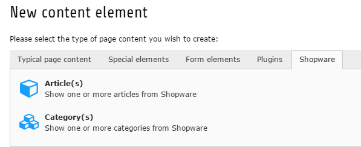

.. ==================================================
.. FOR YOUR INFORMATION
.. --------------------------------------------------
.. -*- coding: utf-8 -*- with BOM.

.. include:: ../../Includes.txt

TYPO3-Shopware-Connector: Überblick
==================================

Die Extension verbindet das Shopware-Shopsystem mit dem TYPO3 CMS. Sie erhält ihre Daten von der Shopware REST-API und
bietet verschiedene Frontend-Plugins um Shopware-Daten wie Produkte, Kategorien, etc. als Listen oder Detail-Ansichten
anzuzeigen.

   Die PxShopware Extension bietet neue Content-Elemente um Produkte, Kategorien, etc. aus Shopware einzubinden.

Die Extension kann nach Installation als Trial- oder Vollversion benutzt werden.

.. note::

    Damit die Extension optimal mit Ihrem Shopware-System zusammen arbeitet, sollten Sie das Plugin "portrino TYPO3-Connector"
    in Ihrer Shop-Instanz einbinden. Sie können das TYPO3-Plugin_ im Shopware-Store erwerben.

Die Extension wurde von Grund auf neu implementiert und basiert auf einer klaren und erweiterbaren Architektur.
Die Frontend-Plugins wurden mit Extbase und Fluid erstellt. Alle Shopware-Daten werden mit dem TYPO3-Caching-Framework
gecached um unnötig häufige API-Calls zu vermeiden und das Frontend-Rendering zu beschleunigen.

.. _TYPO3-Plugin: https://store.shopware.com/
