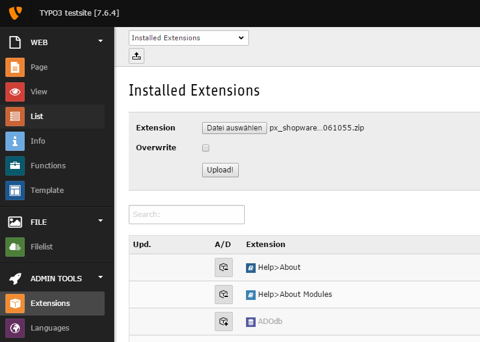
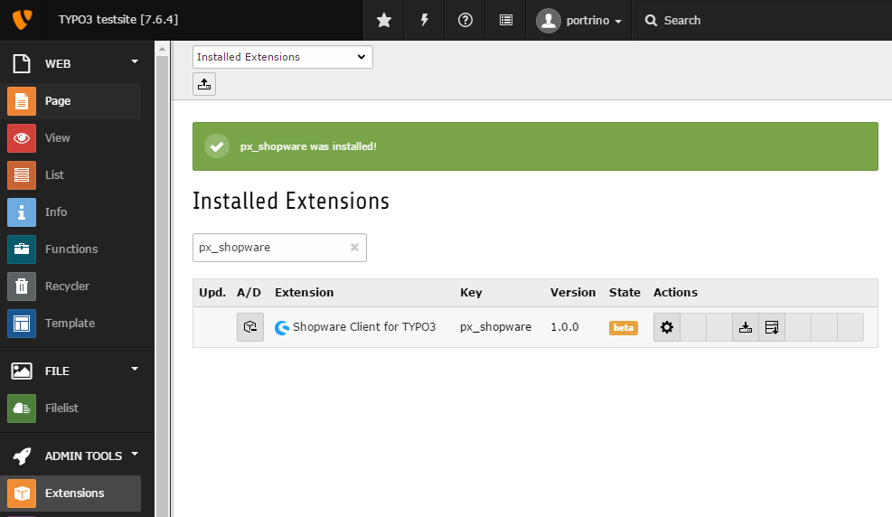

.. ==================================================
.. FOR YOUR INFORMATION
.. --------------------------------------------------
.. -*- coding: utf-8 -*- with BOM.

.. include:: ../Includes.txt

.. _admin-manual:

For Administrators
==================

Import
------

There are two ways of installing the extension. Import the extension to your server from the

- TYPO3 Extension Repository (TER) or
- via GIT

From TER (Classic Mode)
^^^^^^^^^^^^^^^^^^^^^^^

**Download Zip-File**

The extension could also be downloaded and installed from https://typo3.org/extensions/repository/view/px_shopware

    Please use the icon "*Upload Extension .t3x / .zip*" above the dropdown.

    After that a flash message that shopware extension was installed successfully should be visble.

Via composer
^^^^^^^^^^^^

Since TYPO3 7.x you are able to get extension via composer. As described on https://wiki.typo3.org/Composer#Composer_Mode_ you just have to user TYPO3 in Composer Mode
and add this line to your require section within the composer.json file and run composer install / composer update.

.. code-block:: json

    "typo3-ter/px-shopware": "dev-master",

If you want a specific version than change "dev-master" to the version you need.

Installation
------------

Wether you run your TYPO3 in Classic Mode or Composer Mode you should install the extension via ExtensionManager or via Composer. Click `here <https://wiki.typo3.org/Composer>`_ for more details

After the installation is finished open the Extension Configuration by clicking on the "Configure" gear.

.. toctree::
   :maxdepth: 5
   :titlesonly:
   :glob:

   ExtensionManager/Index
   TypoScript/Index

.. _composer: https://getcomposer.org/