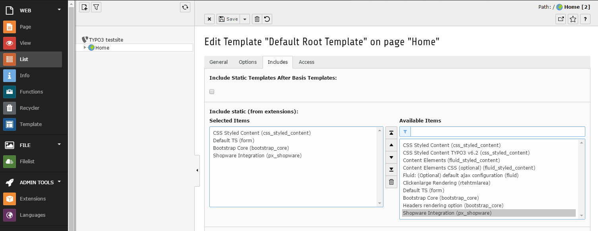
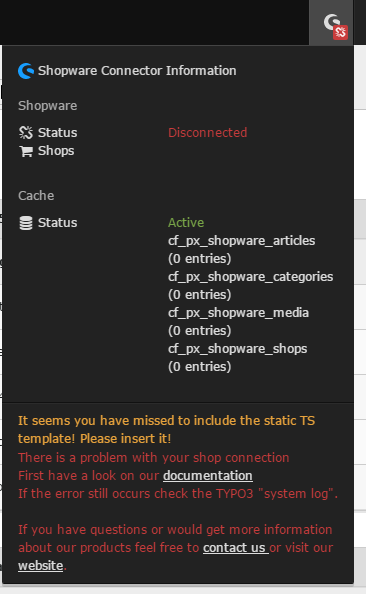

.. ==================================================
.. FOR YOUR INFORMATION
.. --------------------------------------------------
.. -*- coding: utf-8 -*- with BOM.

.. include:: ../../Includes.txt

.. _typoscript-configuration:

Configuration via TypoScript
^^^^^^^^^^^^^^^^^^^^^^^^^^^^

Include Static-Template
-----------------------

Please include the static typoscript first!

| To include the TS directly in your TypoScript please use the following code:
| ``<INCLUDE_TYPOSCRIPT: source="FILE:EXT:px_shopware/Configuration/TypoScript/setup.txt">``
| ``<INCLUDE_TYPOSCRIPT: source="FILE:EXT:px_shopware/Configuration/TypoScript/constants.txt">``
|

If the TypoScript configuration is missing the px_shopware toolbar will display a warning!

TypoScript Values
-----------------

The following settings could be done via TypoScript.

======================================  ==========  ===============================================================================================================================  ====================================================
TypoScript value                        Data type   Description                                                                                                                      Default
======================================  ==========  ===============================================================================================================================  ====================================================
settings.api.url                        string      The Shopware-API url (e.g. http://www.my-online-shop.com/api/)
settings.api.username                   string      The Shopware API user
settings.api.key                        string      The API-Key of the API user
settings.api.languageToShopware         array       The language to shop mapping configuration for sys_language_uid to the specific shop_id in Shopware                                0 { shop_id = 1 sys_language_uid = 0 } ...
settings.cacheLifeTime                  int         The cache lifetime in seconds                                                                                                    3600
settings.noImage.path                   string      The path to the default image (if no article image was given)                                                                    EXT:px_shopware/Resources/Public/Images/
settings.noImage.filename               string      name of the default image                                                                                                        no_image_available.jpg
view.templateRootPaths                  array       Will be used to configure different paths for templates. Will be overriden in reversed order                                     0 = EXT:px_shopware/Resources/Private/Templates/
view.partialRootPaths                   array       Will be used to configure different paths for partials. Will be overriden in reversed order                                      0 = EXT:px_shopware/Resources/Private/Partials/
view.layoutRootPaths                    array       Will be used to configure different paths for layouts. Will be overriden in reversed order                                       0 = EXT:px_shopware/Resources/Private/Layouts/
======================================  ==========  ===============================================================================================================================  ====================================================

Examples
--------

**Add new language**

::

    plugin.tx_pxshopware {
        settings {
            api {
                # shop to locale mapping configuration for correct localization of resources
                languageToShopware {
                    # german (default)
                    0 {
                        shop_id = 1
                        parentCategory = 2
                        sys_language_uid = 0
                    }
                    # english
                    1 {
                        shop_id = 2
                        parentCategory = 463
                        sys_language_uid = 1

                    }
                    # italian
                    2 {
                        shop_id = 3
                        parentCategory = 4198
                        sys_language_uid = 3
                    }
                }
            }
        }
    }

Now all API-Calls will be appended with ``?language=3`` if the italian frontend in TYPO3 will called (e.g.: ``?L=3``).
This will result in the italian translation for the given resource (@see https://developers.shopware.com/developers-guide/rest-api/api-resource-article/#optional-parameters for details)

.. note::

    Articles will be also translated in TYPO3 backend for preview in page mode or during auto suggest in plugin flexform configuration.

**Override partial for articles**

::

    plugin.tx_pxshopware {
        view {
            partialRootPaths {
                20 = EXT:foo_bar/Resources/Private/Partials/
            }
        }
    }

foo_bar/Resources/Private/Partials/Article/Item.html

::

   <f:if condition="{article.url}">
        <f:then>
            <a href="{article.url}">
                <f:render section="article" arguments="{_all}" />
            </a>
        </f:then>
        <f:else>
            <f:render section="article" arguments="{_all}" />
        </f:else>
   </f:if>

   <f:section name="article">
       

           <figure>
               <f:render section="image" arguments="{_all}" />
               <figcaption>
                   <f:if condition="{article.name}">
                       
{article.name}

                   </f:if>
                   <f:if condition="{article.description}">
                       
{article.description -> f:format.raw()}

                   </f:if>
               </figcaption>
           </figure>
       

   </f:section>

   <f:section name="image">
       <f:if condition="{article.firstImage}">
           <f:then>
               
           </f:then>
           <f:else>
               <f:alias map="{height: 200, width: 200}">
                   <f:render partial="NoImage" arguments="{_all}" />
               </f:alias>
           </f:else>
       </f:if>
   </f:section>

**Override partial for categories**

foo_bar/Resources/Private/Partials/Category/Item.html

::

    <f:if condition="{category.url}">
        <f:then>
            <a href="{category.url}">
                <f:render section="category" arguments="{_all}" />
            </a>
        </f:then>
        <f:else>
            <f:render section="category" arguments="{_all}" />
        </f:else>
    </f:if>

    <f:section name="category">
        

            {category.name}

            <f:comment>
                <!-- use this for each loop to iterate through the sub categories -->
                <f:for each="{category.subCategories}" as="subCategory"></f:for>
            </f:comment>

        

    </f:section>