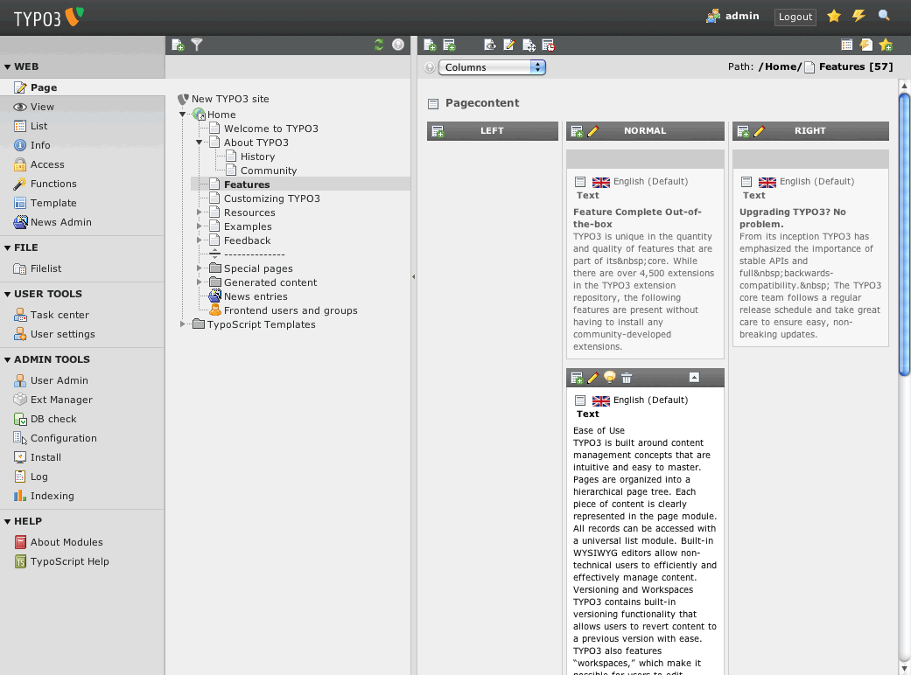

.. ==================================================
.. FOR YOUR INFORMATION
.. --------------------------------------------------
.. -*- coding: utf-8 -*- with BOM.

.. include:: ../Includes.txt

.. _users-manual:

Users manual
============

Configure API Credentials
-------------------------

	Default Backend view (caption of the image)

	The Backend view of TYPO3 after the user has clicked on module "Page". (legend of the image)

Link to official documentation
------------------------------

Sphinx makes it easy to link to official TYPO3 documentation:

- :ref:`TYPO3 Tutorial for Editors <t3editors:start>`
- :ref:`Getting Started Tutorial <t3start:start>`

and you may even link to a very specific chapter explaining how to :ref:`create a browser condition <t3tsref:condition-browser>` within the TypoScript Reference.

For a complete reference of available cross-link prefixes, please consult file ``_make/conf.py``.

FAQ
^^^

Possible subsection: FAQ
